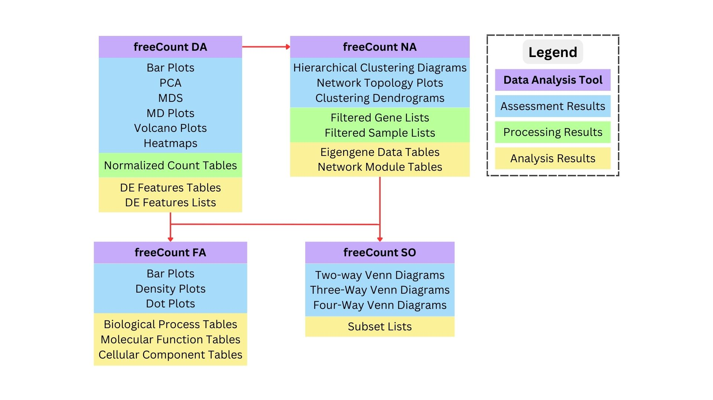
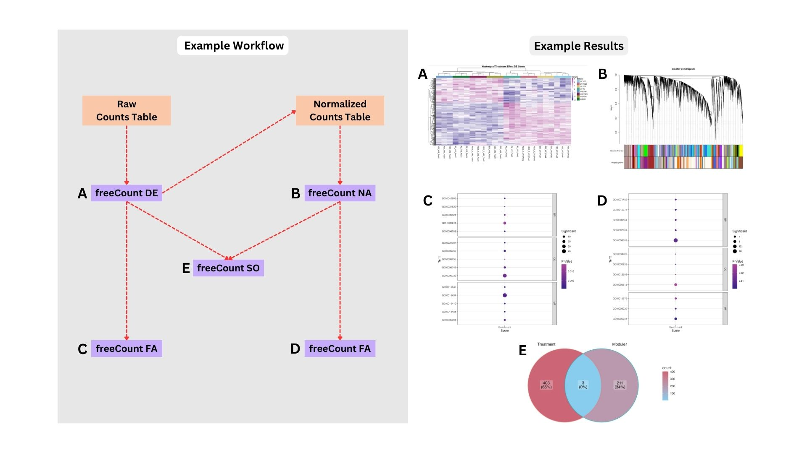
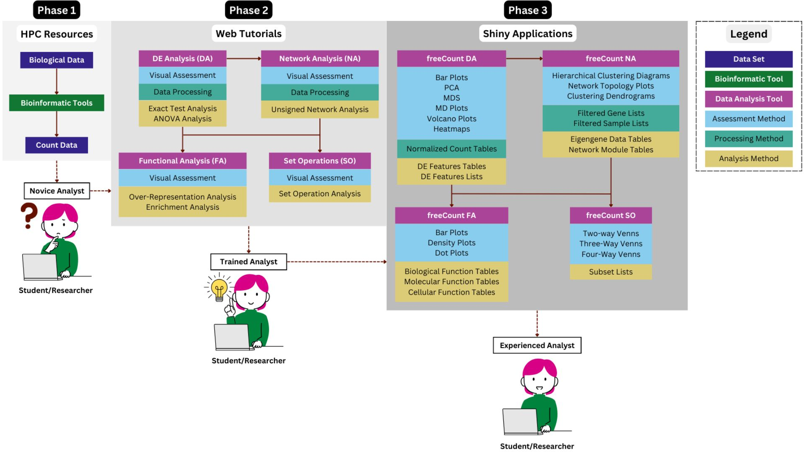

# freeCount

These are R Shiny applications that provide a framework for analyzing biological data produced by genomic sequencing technologies, such as RNA-seq. Users are guided through biological data assessment, processing and analysis. The different analyses available include differential expression (DE), network, and functional analysis.

## Cite
Elizabeth Brooks, Sheri Sanders, Michael Pfrender. 2024. freeCount: A Coding Free Framework for Guided Count Data Visualization and Analysis. In Practice and Experience in Advanced Research Computing (PEARC '24). Association for Computing Machinery, New York, NY, USA. https://doi.org/10.1145/3626203.3670605

## Tools & Features

* **DA**: **D**E **A**nalysis
	* Clustering analysis using distance based PCA and MDS
	* Exact tests with edgeR
	* ANOVA like analysis using GLMs with edgeR
	* Filtering
 		* to remove lowly-expressed genes
 		* by FDR adjusted p-value cut off
 		* by LFC cut off (exact tests only, since GLMs account for LFC cut offs)
* **NA**: **N**etwork **A**nalysis
	* Clustering analysis using hierarchical clustering
	* Unsigned networks with WGCNA
	* Filtering to
 		* remove bad genes and samples
 		* select genes associated with particular modules
* **FA**: **F**unctional **A**nalysis
	* Over-representation analysis using Fisher's exact tests with topGO
	* Enrichment like analysis using rank based Kolmogrov-Smirnov (KS) tests with topGO
	* Filtering
 		* by unadjusted p-value cut off
 		* by candidate GO term list
* **SO**: **S**et **O**perations
	* Venn diagrams with ggVennDiagram
	* Extraction of subsets with gplots

## Analysis Framework 

The following diagram shows the analysis framework for the applications, in addition to potential prep-processing steps. 


Multiple bioinformatics software tools are commonly used to pre-process RNA-seq data. The software used in the development of this analysis framework is shown.

The analysis workflow for the applications begins with the assessment and processing of count data using edgeR, which can then be followed by DE analysis.

The normalized data output by edgeR can also be input to WGCNA to begin the network analysis process.

Results from the DE or network analyses can be used to perform downstream analyses, such as functional analysis or set operations.

### Analysis Results

Each of the applications produces multiple resulting plots and tables, which are shown in the diagram below.



### Example Workflow

A sample workflow using the freeCount applications is shown below, along with example results produced by each application.



### User Journey

The following user journey diagram depicts the user-centered process of count data analysis through the R Shiny applications.



The typical user is a student or researcher who begins their journey as a novice analyst. In the first phase the novice analyst has received count data, but they are unsure how to proceed. The second phase is where the analyst completes our web tutorials and now has an idea about how to proceed with analyzing their data. In the third phase the analyst uses our shiny applications to produce high-quality analysis results.

## Tutorials

> [!IMPORTANT]
> The tutorials for using the applications or creating scripts for the different analyses can be found in the [tutorials](https://github.com/ElizabethBrooks/DGEAnalysis_ShinyApps/tree/main/tutorials) folder of this repository.

Additional tutorials are available on the following pages of my website, go into further detail about the different analyses and other helpful information.
* Helpful information for downloading the applications in this repository can be found in the tutorial [GitHub Version Control Quick Start Guide](https://morphoscape.wordpress.com/2024/02/28/github-version-control-quick-start-guide/).
* A tutorial of the biostatistical analysis performed in this application is provided in [Downstream Bioinformatics Analysis of Omics Data with edgeR](https://morphoscape.wordpress.com/2022/08/09/downstream-bioinformatics-analysis-of-omics-data-with-edger/).
* Gene tables were may be created from RNA-seq data as described in [Bioinformatics Analysis of Omics Data with the Shell & R](https://morphoscape.wordpress.com/2022/07/28/bioinformatics-analysis-of-omics-data-with-the-shell-r/).

### Example Data Sets

Example gene counts and experimental design tables are also provided in the [data](https://github.com/ElizabethBrooks/DGEAnalysis_ShinyApps/tree/main/data) folder of this repository.

A sample RNA-seq data set may also be obtained from [NCBI](https://www.ncbi.nlm.nih.gov/bioproject/PRJNA504739/), for example.

## Installation & Running

Each of the R shiny applications can be run locally on your computer using R and Posit. Continue reading for helpful information on installing and running the apps.

### Installation

<b>First,</b> download this GitHub repository using the git clone command in the terminal as follows.

To download the code onto a local computer or server space, click the green <i>< > Code</i> button and copy the link. Then, using the HTTPS web URL in the terminal:

git clone https://github.com/ElizabethBrooks/freeCount.git

Alternatively, using SSH:

git clone git@github.com:ElizabethBrooks/freeCount.git

The latest version of this application may also be downloaded from this repository by clicking the green <i>< > Code</i> button near the top of the page, and then clicking <i>Download ZIP</i>.

<b>Second</b>, if running the app locally, you will need to install or update [R and Posit](https://posit.co/download/rstudio-desktop/).

<b>Third</b>, open Posit (formerly RStudio) and before clicking the <i>Run App</i> button, make sure to install all of the necessary R packages for each of the applications.

### freeCount DA
```
packageList <- c("BiocManager", "shiny", "shinythemes", "ggplot2", "rcartocolor", "dplyr", "statmod", "pheatmap", "ggplotify")
biocList <- c("edgeR")
newPackages <- packageList[!(packageList %in% installed.packages()[,"Package"])]
newBioc <- biocList[!(biocList %in% installed.packages()[,"Package"])]
if(length(newPackages)){
  install.packages(newPackages)
}
if(length(newBioc)){
  BiocManager::install(newBioc)
}
```

### freeCount NA
```
packageList <- c("BiocManager", "shiny", "shinythemes", "dplyr", "matrixStats", "Hmisc", "splines", "foreach", "doParallel", "fastcluster", "dynamicTreeCut", "survival")
biocList <- c("WGCNA", "GO.db", "impute", "preprocessCore")
newPackages <- packageList[!(packageList %in% installed.packages()[,"Package"])]
newBioc <- biocList[!(biocList %in% installed.packages()[,"Package"])]
if(length(newPackages)){
  install.packages(newPackages)
}
if(length(newBioc)){
  BiocManager::install(newBioc)
}
```

### freeCount FA
```
packageList <- c("BiocManager", "shiny", "shinythemes", "ggplot2", "rcartocolor", "tidyr")
biocList <- c("topGO", "Rgraphviz")
newPackages <- packageList[!(packageList %in% installed.packages()[,"Package"])]
newBioc <- biocList[!(biocList %in% installed.packages()[,"Package"])]
if(length(newPackages)){
  install.packages(newPackages)
}
if(length(newBioc)){
  BiocManager::install(newBioc)
}
```

### freeCount SO
```
packageList <- c("BiocManager", "shiny", "shinythemes", "ggplot2", "rcartocolor", "ggVennDiagram", "gplots")
newPackages <- packageList[!(packageList %in% installed.packages()[,"Package"])]
if(length(newPackages)){
  install.packages(newPackages)
}
```

### Running

> [!TIP]
> To run the selected app, open the R script for the app in Posit and press the <i>Run App</i> button in the upper right corner of the [source pane](https://docs.posit.co/ide/user/ide/guide/ui/ui-panes.html).

After the app is launched you will see the following pages:
1. <i>Getting Started</i> page with information for uploading data to start the analysis
2. <i>Processing</i> page that indicates the analysis has begun running
3. a page with separate tabs for each step in the analysis workflow

## Methods

### freeCount DA

Differential expression (DE) analysis can be used to identify DE genes using the edgeR package (Chen, Lun & Smyth, 2016) in R (R Core Team, 2023). Library sizes are calculated for each sample before normalizing with trimmed mean of M-values (TMM) between each pair of samples. The clustering of samples with a PCA is performed using edgeR to create a multidimensional scaling (MDS) plot of the distances between gene expression profiles, in which the same genes are selected for all comparisons. Two-way ANOVAs is calculated using generalized linear models (GLMs) to identify genes with significant DE above an input log2 fold-change (LFC) threshold using t-tests relative to a threshold (TREAT) with the glmTreat function of edgeR (McCarthy & Smyth, 2009). The resulting tables of DE genes can be filtered by statistical or biological significance, including false discoverey rate (FDR) or LFC.

### freeCount NA

Gene co-expression networks can be generated to increase the power of functional analyses. Networks should be constructed with the log-transformed normalized gene counts using the R package WGCNA (Langfelder & Horvath, 2008; Zhang & Horvath, 2005). An unsigned network can be created to enable the detection of modules with genes that have mixed directions of expression. The co-expression networks should be manually constructed with a recommended minimum module size of 30 and soft thresholding power of 9, which is where the scale free topology model fit was above 0.8 and mean connectivity under the hundreds (Horvath, 2011).

### freeCount FA

Significantly over-represented or enriched GO terms can be determined using the R package topGO (Alexa & Rahnenfuhrer, 2022) to perform Fisher's exact or Kolmogorov-Smirnov (KS) like tests. These tests allow users to identify any pathways observed in the selected set of genes more than expected by chance against the background set of all genes that were sufficiently expressed for further analysis given the sample library sizes and experimental design. The genes that were sufficiently expressed for further analysis were determined using the filterByExpr function of edgeR.

### freeCount SO

The intersection of DE genes and modules can be identified by comparing the sets of genes placed in each network module to the set of DE genes. The genes contained in the intersections of sets are extracted using the venn function of the gplots R package (Warnes et al., 2022). The set relationships are visualized using the ggVennDiagram package (Gao et al., 2024).

## Contributions & Acknowledgements

These applications were developed by [Elizabeth Brooks](https://www.linkedin.com/in/elizabethmbrooks/) with the guidance and support of Sheri Sanders and Michael Pfrender.

We would like to thank the students and researchers at ND who provided feedback for the application tools and tutorials. A special thank you to the Schorey (William McManus) and Pfrender (Neil McAdams, Bret Coggins, Nitin Vincent) labs for feature feedback. This project was supported by Notre Dame Research and the National Science Foundation (NSF) grant "Collaborative Research: EDGE FGT: Genome-wide Knock-out mutant libraries for the microcrustacean Daphnia" (2220695/2324639 to Sen Xu and 2220696 to Michael E. Pfrender). This work used Jetstream2 at Indiana University through allocation BIO230029 from the Advanced Cyberinfrastructure Coordination Ecosystem: Services \& Support (ACCESS) program, which is supported by NSF grants 2138259, 2138286, 2138307, 2137603, and 2138296.

## References

[1] Adrian Alexa and Jorg Rahnenfuhrer. 2023. topGO: Enrichment Analysis for Gene
Ontology. https://doi.org/10.18129/B9.bioc.topGO R package version 2.52.0.

[2] Patrick Blumenkamp, Max Pfister, Sonja Diedrich, Karina Brinkrolf, Sebastian
Jaenicke, and Alexander Goesmann. 2024. Curare and GenExVis: a versatile
toolkit for analyzing and visualizing RNA-Seq data. BMC Bioinformatics 25, 1
(March 2024).

[3] Winston Chang, Joe Cheng, JJ Allaire, Carson Sievert, Barret Schloerke, Yihui Xie,
Jeff Allen, Jonathan McPherson, Alan Dipert, and Barbara Borges. 2024. shiny:
Web Application Framework for R. https://shiny.posit.co/ R package version
1.8.1.9000, https://github.com/rstudio/shiny.

[4] Yunshun Chen, Lizhong Chen, Aaron T. L. Lun, Pedro L. Baldoni, and Gordon K.
Smyth. 2024. edgeR 4.0: powerful differential analysis of sequencing data
with expanded functionality and improved support for small counts and
larger datasets. bioRxiv (2024). https://doi.org/10.1101/2024.01.21.576131
arXiv:https://www.biorxiv.org/content/early/2024/01/24/2024.01.21.576131.full.pdf

[5] The Galaxy Community. 2022. The Galaxy platform for accessible, reproducible
and collaborative biomedical analyses: 2022 update. Nucleic Acids Res. 50, W1
(2022), W345–W351. https://doi.org/10.1093/nar/gkac247

[6] David Y Hancock, Jeremy Fischer, John Michael Lowe, Winona Snapp-Childs,
Marlon Pierce, Suresh Marru, J Eric Coulter, Matthew Vaughn, Brian Beck, Nirav
Merchant, Edwin Skidmore, and Gwen Jacobs. 2021. Jetstream2: Accelerating
cloud computing via Jetstream. In Practice and Experience in Advanced Research
Computing (Boston MA USA). ACM, New York, NY, USA.

[7] Steve Horvath. 2011. Weighted network analysis (2011 ed.). Springer, New York,
NY.

[8] Wolfgang Huber, Vince Carey, Robert Gentleman, Simon Anders, Marc Carlson,
Benilton Carvalho, Hector Corrada Bravo, Sean Davis, Laurent Gatto, Thomas
Girke, Raphael Gottardo, Florian Hahne, Kasper Hansen, Rafael Irizarry, Michael
Lawrence, Michael Love, James MacDonald, Valerie Obenchain, Andrzej Oleś,
and Martin Morgan. 2015. Orchestrating high-throughput genomic analysis with
Bioconductor. Nature methods 12 (01 2015), 115–21. https://doi.org/10.1038/
nmeth.3252

[9] Alper Kucukural, Onur Yukselen, Deniz M Ozata, Melissa J Moore, and Manuel
Garber. 2019. DEBrowser: interactive differential expression analysis and visual-
ization tool for count data. BMC Genomics 20, 1 (Jan. 2019), 6.

[10] Peter Langfelder and Steve Horvath. 2012. Fast R Functions For Robust Corre-
lations And Hierarchical Clustering. Journal of statistical software 46 (03 2012).
https://doi.org/10.18637/jss.v046.i11

[11] Federico Marini, Jan Linke, and Harald Binder. 2020. ideal: an R/Bioconductor
package for interactive differential expression analysis. BMC Bioinformatics 21, 1
(Dec. 2020), 565.

[12] Davis J McCarthy and Gordon K Smyth. 2009. Testing significance relative to a
fold-change threshold is a TREAT. Bioinformatics 25, 6 (March 2009), 765–771.

[13] R Core Team. 2023. R: A Language and Environment for Statistical Computing. R
Foundation for Statistical Computing, Vienna, Austria. https://www.R-project.
org/

[14] Himangi Srivastava, Drew Ferrell, and George V Popescu. 2022. NetSeekR: a
network analysis pipeline for RNA-Seq time series data. BMC Bioinformatics 23,
1 (Jan. 2022), 54.

[15] Guy Teichman, Dror Cohen, Or Ganon, Netta Dunsky, Shachar Shani, Hila Gin-
gold, and Oded Rechavi. 2023. RNAlysis: analyze your RNA sequencing data
without writing a single line of code. BMC Biol. 21, 1 (April 2023), 74.

[16] Qin Zhu, Stephen A Fisher, Hannah Dueck, Sarah Middleton, Mugdha Khal-
adkar, and Junhyong Kim. 2018. PIVOT: platform for interactive analysis and
visualization of transcriptomics data. BMC Bioinformatics 19, 1 (Dec. 2018).
